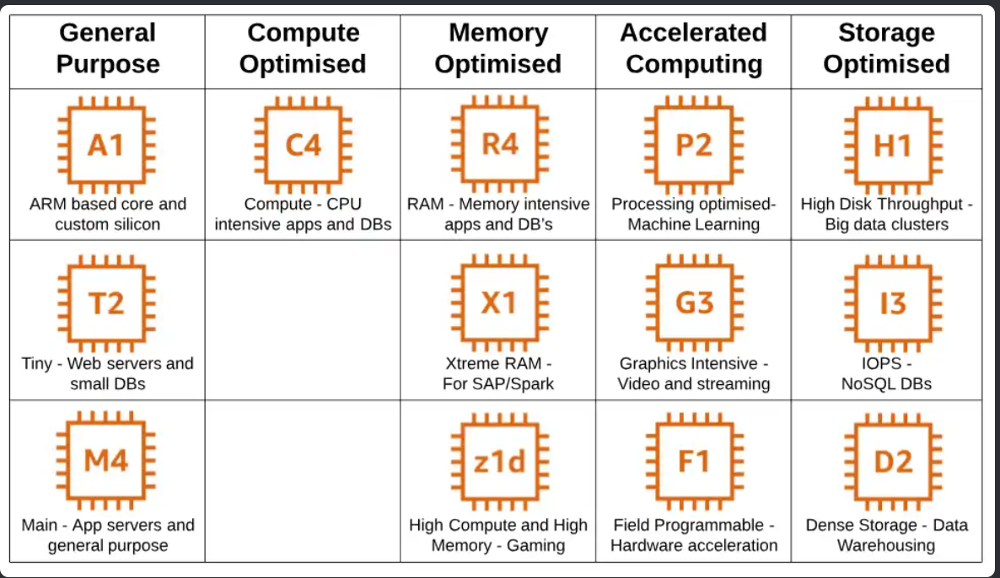
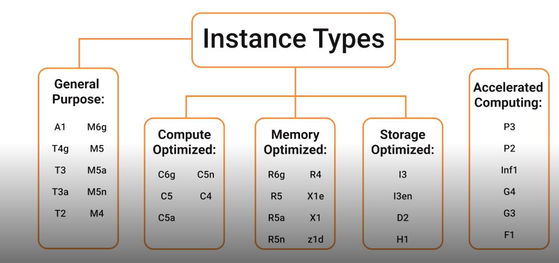

# Maquinas virtuais( EC2), storage (EBS e S3) e backup (AMI, Snapshot) da AWS
*Esse repositório contém minhas anotações do laboratório de EC2 na AWS, com foco em instâncias, storage e backup.*

## EC2

* EC2, são maquinas virtuais na aws podendo ser composta dos sistemas operacionais windows ou Linux, possuem cpu, memória, dico, rede e sistema operacional.

* O EC2 é do tipo Iaas, infraestrutura como recursos, nesse caso o gerenciamento do maquina virtual é de responsabilidade do desenvolvedor/cliente.

### Tipos de instâncias EC2

* Cada tipo de instâncias oferece diferentes recursos computacionais.
### Diferenças entre tipos de instâncias EC2

|Uso Geral (t2.micro, t3.micro, t3.small)| Equilíbrio entre CPU, memória e rede| Bom para aplicações pequenas, ambientes de teste e aprendizado|
|-|-|-|
|Tipo| Vantagem/Diferencial| Uso Prático|
|Otimizada para Computação (c5, c6g)| Mais CPU do que memória| Boa para processamento intenso: cálculos científicos, renderização, servidores de jogos|
|Otimizada para Memória (r5, r6g)| Mais memória RAM| Indicada para bancos de dados em memória, caching, analytics|
|Otimizada para Armazenamento (i3, d2)| Alta capacidade de armazenamento local e I/O| Boa para Big Data, Data Warehousing, sistemas de arquivos distribuídos|
|Aceleradas (p3, g4dn, inf1)| Possuem GPUs ou chips específicos| Usadas em Machine Learning, IA, renderização gráfica, inferência|

## Storage

### EBS

* É uma storage que pode ser anexado em qualquer instância EC2, possui um volume de armazenamento, funciona como um HD externo.
* Pode ser usado para armazenamento de banco de dados; MySQL, PostgreSQL, e oracle
* Armazenar dados para app webs e logs de sistemas.
* Só pode ser acessado pela instância à qual está anexado.
* Continua existindo mesmo se a instância for desligada (a menos que você configure para deletar junto).
* Cobrança: por GB provisionado + tipo do volume (SSD, HDD, provisionado para IOPS).

### S3

* É um serviço de armazenamento de objetos ou recursos em nuvem, ideal para armazenar de forma segura um grande volume de dados de forma escalável.
* Não está preso a uma instância → pode ser acessado de qualquer lugar via API, CLI, console, aplicações.
* Ideal para guardar imagens, vídeos, backups, documentos, logs, sites estáticos.
* Altamente escalável (você pode guardar terabytes ou petabytes).
* Cobrança: por GB armazenado + requisições (PUT, GET, LIST).
* Analogia: É como o Google Drive/Dropbox da AWS, mas muito mais poderoso e integrado.

## Backup

### Criação e uso de imagens AMI

* No EC2 o AMI é uma imagem de máquina virtual pré-configurada, inclui as informações necessárias para iniciar uma instância como o sistema operativo, o servidor de aplicações e as aplicações.

* Pode ser criadas a partir de instâncias em execução ou paradas, permitindo capturar um instantâneo do seu ambiente configurado.

* A AWS possui AMIs públicas e privadas e permite a criação de uma AMI personalizada.

* É possível personalizar uma instância e em seguida criar uma AMI a partir dela, facilitando a replicação do ambiente de trabalho.

### Snapshot (Backup)

* É um serviço de backup nativo do AWS e faz backup dos volumes do EBS em um determinado momento.

* É possível configurar e programar a frequência, o seu armazenamento é feito no S3.

* A diferença entre uma AMI e uma Snapshot, é que uma AMI faz o backup de um servidor inteiro, incluindo todos os volumes EBS anexados, o Snapshot é uma cópia pontual de uma determinado volume do EBS e salvo no S3.
  

| **Característica** | **AMI (Amazon Machine Image)**                              | **Snapshot**                             |
|---------------------|-------------------------------------------------------------|------------------------------------------|
| O que é?           | Imagem completa de uma máquina (sistema + apps + configs).  | Cópia pontual de um volume EBS.          |
| Escopo             | Inclui todos os volumes e a configuração da instância.      | Apenas o volume EBS selecionado.         |
| Uso principal      | Lançar novas instâncias iguais à original.                  | Restaurar ou clonar volumes EBS.         |
| Onde é armazenado  | No S3 (internamente pela AWS).                              | Também armazenado no S3.                 |
| Criação            | Pode ser feita de uma instância em execução/parada.         | Pode ser feita de qualquer volume EBS.   |
| Exemplo prático    | Criar uma AMI de um servidor web configurado para replicar. | Snapshot de um volume de banco de dados. |

## Resumo geral do funcionamento EC2 da AWS
* Escolhe-se uma AMI, (sistema operacional + softwares básicos da VM), exemplo: Ubuntu 22.04, Windows Server, ou até AMIs personalizadas.
* Escolhe-se um tipo de instância (CPU, memória, armazenamento e rede), exemplo: t2.micro (leve, grátis no Free Tier), m5.large (uso geral), p3.2xlarge (GPU para IA).
* Configuração do armazenamento, adição de volumes EBS (HD/SSD virtuais).
*  define-se regras de rede (Security Groups)
  
### Usos do EC2
* Hospedar sites e APIs.
* Rodar bancos de dados (apesar de haver serviços específicos como RDS).
* Treinar modelos de Machine Learning em instâncias com GPU.
* Criar ambientes de teste/laboratório.
* Automatizar processos com scripts.

